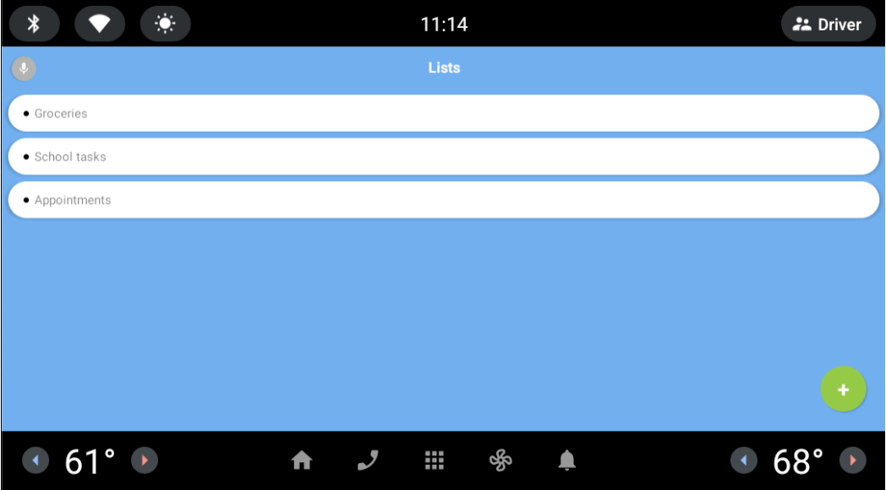
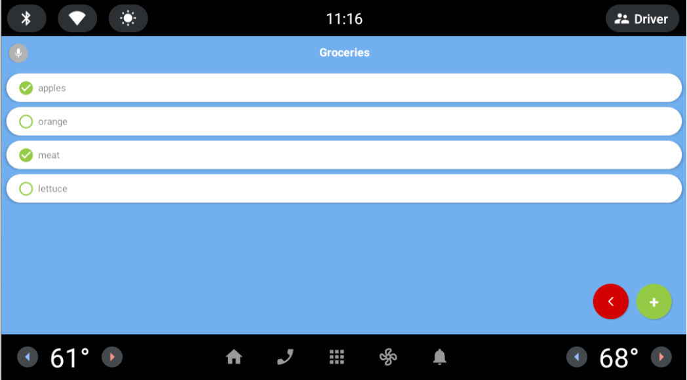

# ChecklistAuto

This is an application focused on the android auto platform. Users can create lists, check/uncheck items and manage them
while they are driving through voices commands. To test the voice commands, you must say the commands in english.

## Example of commands

| Voice Command                        | Description                                             |
|--------------------------------------|---------------------------------------------------------|
| Read lists                           | The app will read each list name                        |
| Open list <list_name>                | The app will navigate to list screen and show all items |
| Create list <list_name>              | The app will create a new list                          |
| Delete list <list_name>              | The app will remove the list                            |
| Read items                           | The app will read each item from the current list       |
| Check/Change item <item_description> | The app will toggle the item status                     |
| Create item <item_description>       | The app will create a new item in the current list      |
| Delete item <item_description>       | The app will remove the item                            |

## Screens

Demo Video

https://github.com/MatheusHenAlmeida/checklist-android-auto/assets/49349048/6f1cd073-a733-4d50-b6ca-154b1e5e683f

Lists Screen

  
Items Screen

